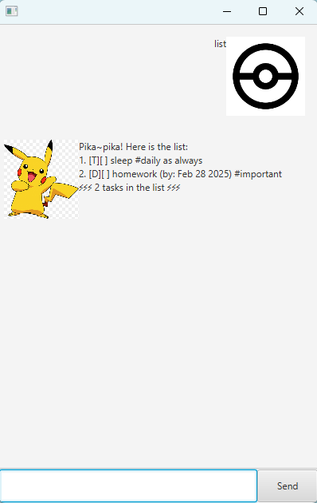

# Pikachu User Guide



This is Pikachu chatbot & task manager. You can manage your tasks efficiently by entering details of the task.

For example:
- Add a deadline task
- Mark task as done
- Add tags for a task
etc...

## Adding tasks: `todo event deadline`

# Add Todo task: `todo`

Add task you plan to do to Pikachu.

Format: `todo task_description`

Example: `todo sleep`

A sleep task will be added to Pikachu.

Output:
```
Added: [T][ ] sleep 
⚡⚡⚡ 1 tasks in the list ⚡⚡⚡
```

# Add Event task: `event`

Add event you plan to do to Pikachu.

Format: `event task_description /from from_date /to to_date`

Example: `event sleep /from day /to night `

An event sleep will be added to Pikachu.

Output:
```
Added: [E][ ] sleep (from: day, to: night) 
⚡⚡⚡ 2 tasks in the list ⚡⚡⚡
```

# Add Event task: `event`

Add an event to Pikachu.

Format: `event task_description /from from_date /to to_date`

Example: `event sleep /from day /to night `

An event sleep will be added to Pikachu.

Output:
```
Added: [E][ ] sleep (from: day, to: night) 
⚡⚡⚡ 2 tasks in the list ⚡⚡⚡
```

# Add Deadline task: `deadline`

Add deadline to Pikachu. 

Format: `deadline task_description /by yyyy-MM-DD`

Example: `deadline Pokemon Master /by 2025-12-31`

A deadline to be Pokemon Master will be added to Pikachu.

Output:
```
Added: [D][ ] Pokemon Master (by: Dec 31 2025) 
⚡⚡⚡ 3 tasks in the list ⚡⚡⚡
```

## Listing all tasks: `list`

List out all the tasks.

Example: `list`

Output:
```
Pika~pika! Here is the list:
1. [T][ ] sleep
2. [E][ ] sleep (from: day, to: night) 
3. [D][ ] Pokemon Master (by: Dec 31 2025) 
⚡⚡⚡ 3 tasks in the list ⚡⚡⚡
```

## Deleting task: `delete`

Delete task by index.

Example: `delete 1`

Output:
```
Pika! This task has been deleted:
[T][ ] sleep
⚡⚡⚡ 2 tasks in the list ⚡⚡⚡
```

## Marking and unmarking task: `mark unmark`

# Mark task: `mark`

Mark task by index.

Example: `mark 1`

Output:
```
Pika! This task has been marked as done:
[E][X] sleep (from: day, to: night) 
⚡⚡⚡ 2 tasks in the list ⚡⚡⚡
```

# Unmark task: `unmark`

Unmark task by index.

Example: `unmark 1`

Output:
```
Pika! This task has been marked as not done yet:
[E][ ] sleep (from: day, to: night) 
⚡⚡⚡ 2 tasks in the list ⚡⚡⚡
```

## Finding tasks: `find`

Find tasks with keyword.

Format: `find keyword`

Example: `find master`

Output:
```
Pika! These tasks has been found:
1. [D][ ] Pokemon Master (by: Dec 31 2025) 
⚡⚡⚡ 2 tasks in the list ⚡⚡⚡
```

## Tagging task: `tag`

Tag task with keyword and index.

Format: `tag index keyword`

Example: `tag 2 daily`

Output:
```
Added tag #daily to task:
 [E][ ] sleep (from: day, to: night) #daily
```

## Saying goodbye: `bye`

Says goodbye to Pikachu.

Example: `bye`

Output:
```
Bye. Pikachu wants to see you again soon!
```